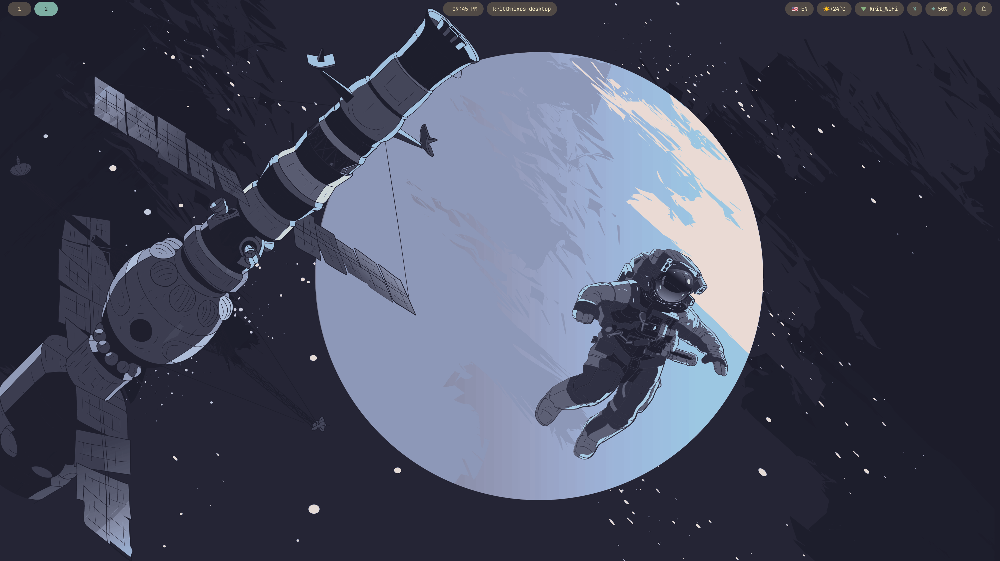
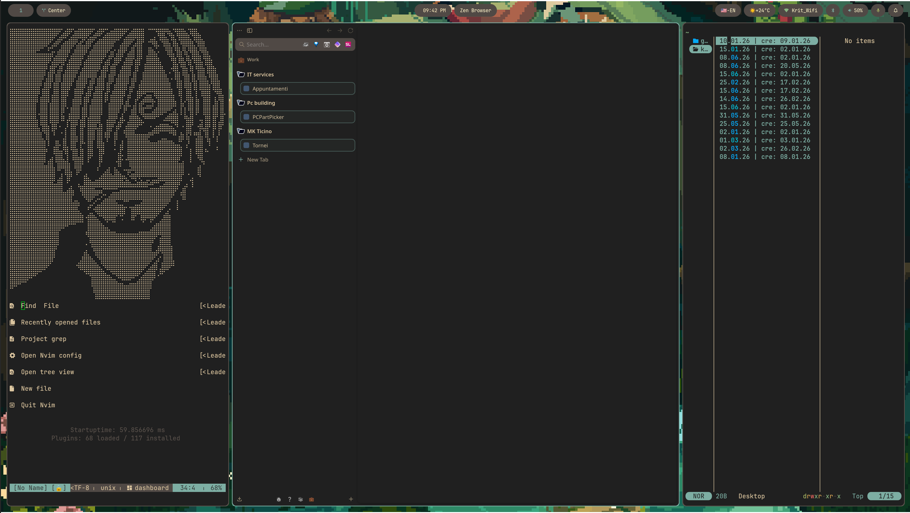

# Showcase

> This is not a comprehensive list. Every window manager supports quickshell as a custom shell, which can replace the default bar/panel setup and produce a distinct look not shown here.

## Hyprland with waybar

## Hyprland with Caelestia

## Hyprland with Caelestia/quickshell lockscreen

## Hyprland with noctalia

## Hyprland with noctalia/quickshell lockscreen

## Niri

## MangoWM

## KDE

## Gnome

## XFCE

## Hyprlock

