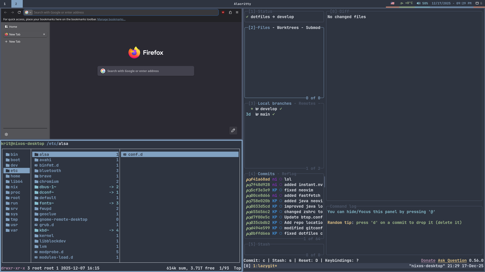
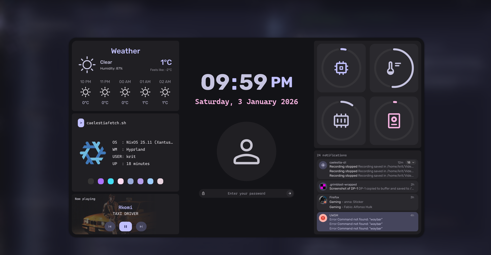
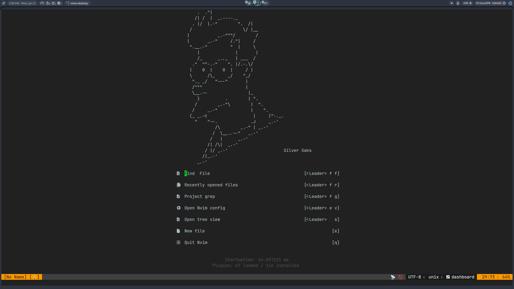
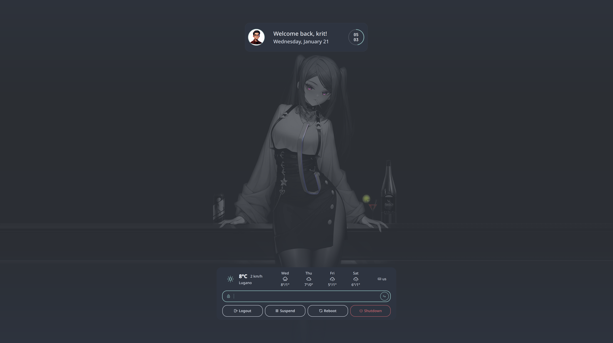
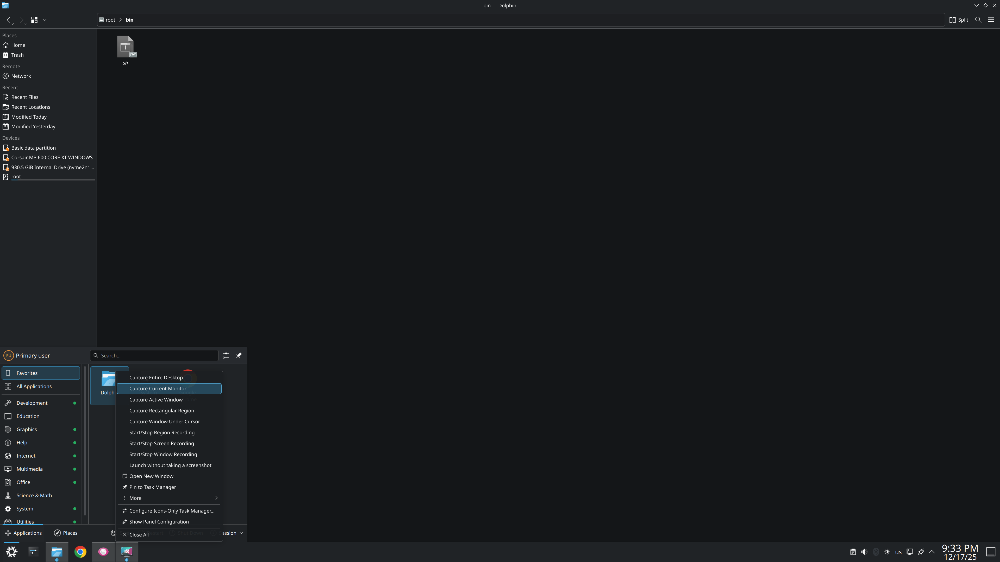
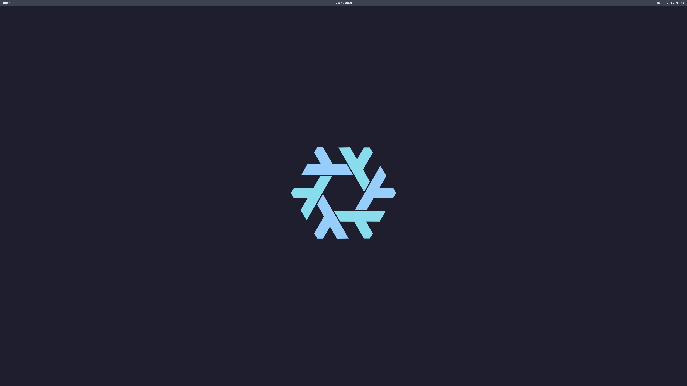
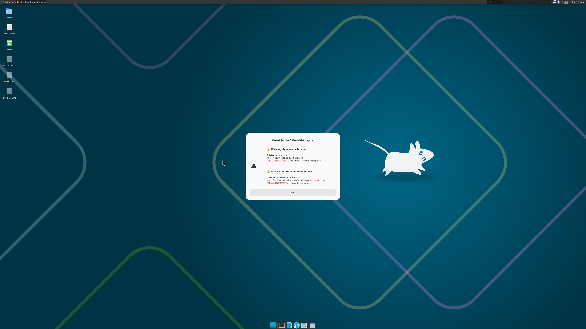

# Branch
- This stable branch is meant to not use cachix, meaning flake.lock and relevant version can be older one

# ❄️ Personal NixOS Config

## Hyprland + waybar + lazygit + ranger + firefox



## Hyprland + caelestia/quickshell


- [❄️ Personal NixOS Config](#️-personal-nixos-config)
  - [Hyprland + waybar + lazygit + ranger + firefox](#hyprland--waybar--lazygit--ranger--firefox)
  - [Hyprland + caelestia/quickshell](#hyprland--caelestiaquickshell)
  - [✨ Features](#-features)
    - [🖥️ Adaptive Host Support:](#️-adaptive-host-support)
      - [Host-specific home-manager modules](#host-specific-home-manager-modules)
      - [Host-specific home options](#host-specific-home-options)
      - [Host-specific general home-manager modules tweaks](#host-specific-general-home-manager-modules-tweaks)
    - [📦 Package version and flatpak](#-package-version-and-flatpak)
    - [❄️ Hybrid (declarative + non declarative for some modules)](#️-hybrid-declarative--non-declarative-for-some-modules)
    - [🎨 Theming](#-theming)
    - [🖌️ Wallpaper(s)](#️-wallpapers)
      - [kde-main.nix](#kde-mainnix)
      - [gnome-main.nix](#gnome-mainnix)
    - [niri-main.nix](#niri-mainnix)
    - [cosmic-main.nix](#cosmic-mainnix)
    - [🪟 Multiple Desktop Environments](#-multiple-desktop-environments)
      - [✅ The Safe Way (Prevent Lockouts)](#-the-safe-way-prevent-lockouts)
      - [🚨 Emergency Recovery (Stuck in TTY)](#-emergency-recovery-stuck-in-tty)
      - [🛠️ Troubleshooting](#️-troubleshooting)
    - [👤 Ephemeral Guest User](#-ephemeral-guest-user)
    - [🏠 Home Manager Integration](#-home-manager-integration)
    - [🧇 Tmux](#-tmux)
    - [🌟 Multiple shells + Starship](#-multiple-shells--starship)
    - [🦺 Optional BTRFS snapshots](#-optional-btrfs-snapshots)
    - [❔ SOPS-nix support](#-sops-nix-support)
    - [📦 Cachix support](#-cachix-support)
    - [🖥️ Multi-architecture support](#️-multi-architecture-support)
- [🚀 NixOS Installation Guide](#-nixos-installation-guide)
  - [📦 Phase 1: Preparation](#-phase-1-preparation)
    - [1. Download \& Flash](#1-download--flash)
    - [2. Boot \& Connect](#2-boot--connect)
  - [💾 Phase 2: The Terminal Installation](#-phase-2-the-terminal-installation)
    - [1. Download the Config](#1-download-the-config)
    - [2. Identify Your Disk](#2-identify-your-disk)
    - [3. Create Your Host](#3-create-your-host)
    - [4. Configure the Drive](#4-configure-the-drive)
    - [5. Configure Critical Variables](#5-configure-critical-variables)
    - [6. Install (The Magic Step)](#6-install-the-magic-step)
    - [7. Finish](#7-finish)
  - [🎨 Phase 3: Post-Install Setup](#-phase-3-post-install-setup)
    - [1. Move Config to Home](#1-move-config-to-home)
    - [2. (Optional) Cleanup Unused Hosts](#2-optional-cleanup-unused-hosts)
  - [🛠️ Phase 4: Customization](#️-phase-4-customization)
    - [Refine `variables.nix`](#refine-variablesnix)
      - [An hosts variable config example:](#an-hosts-variable-config-example)
    - [Setup (optional) `local-packages.nix`](#setup-optional-local-packagesnix)
    - [Setup (optional) `flatpak.nix`](#setup-optional-flatpaknix)
    - [Setup (optional) `modules.nix`](#setup-optional-modulesnix)
    - [Setup (optional) `home.nix`](#setup-optional-homenix)
    - [Setup (optional) `host-modules` folder](#setup-optional-host-modules-folder)
  - [Phase 5: Setup optional host-specific files and directories](#phase-5-setup-optional-host-specific-files-and-directories)
    - [1. (Optional) Customize the host-specific `modules.nix`](#1-optional-customize-the-host-specific-modulesnix)
    - [2. (Optional) Customize the host-specific `home.nix`](#2-optional-customize-the-host-specific-homenix)
    - [3. (Optional) Customize the host-specific `host-modules` directory](#3-optional-customize-the-host-specific-host-modules-directory)
  - [🔄 Daily Usage \& Updates](#-daily-usage--updates)
  - [❓ Troubleshooting](#-troubleshooting)
    - [Error: `path '.../hardware-configuration.nix' does not exist`](#error-path-hardware-configurationnix-does-not-exist)
    - [Error: `home-manager: command not found`](#error-home-manager-command-not-found)
    - [Error: `permission denied` opening `flake.lock`](#error-permission-denied-opening-flakelock)
    - [Error: `returned non-zero exit status 4` during rebuild](#error-returned-non-zero-exit-status-4-during-rebuild)
    - [Weird keyboard layout during install](#weird-keyboard-layout-during-install)
    - [Caelestia/noctalia: some fonts issue](#caelestianoctalia-some-fonts-issue)
  - [❄️ Note on the declarative aspects](#️-note-on-the-declarative-aspects)
  - [📝 Project Origin and Customization](#-project-origin-and-customization)
  - [Showcase](#showcase)
    - [Hyprland with waybar](#hyprland-with-waybar)
    - [Hyprland with Caelestia/quickshell lockscreen](#hyprland-with-caelestiaquickshell-lockscreen)
    - [Hyprland with noctalia](#hyprland-with-noctalia)
    - [Hyprland with noctalia/quickshell lockscreen](#hyprland-with-noctaliaquickshell-lockscreen)
    - [KDE](#kde)
    - [Gnome](#gnome)
    - [XFCE](#xfce)
  - [Other resources](#other-resources)
    - [Structure](#structure)
    - [In-depth-files-expl](#in-depth-files-expl)
    - [Issues](#issues)
    - [Ideas](#ideas)
    - [Usage guide](#usage-guide)

## ✨ Features

### 🖥️ Adaptive Host Support:

Define unique hardware parameters (monitors, theming, keyboard layout, wallpapers, etc) per machine while keeping the core environment identical. All these customized options can be changed in the host-specific directory

- This allow to have a tailored experience right from the start,
- For reference look point ([5. Configure the host folder](#5-configure-the-hosts-folder)).
- A variables can be added anytime and it is automatically recognized. Then if it needs to be called it can be simply done by appending `vars.` to the name of the variable

#### Host-specific home-manager modules

- Inside the host folder it is possible to create home-manager modules. These are modules that unlike local packages can configure with home-manager, but they do not add noise in the general home-manager folder.
  - This allow to have customized packages but that apply only to certain hosts

#### Host-specific home options

- Allow to create home.nix options but that are host-specific
  - For example on an host you may want to have certain session variables or create/remove specific directories

#### Host-specific general home-manager modules tweaks

- Allow to add/customize some feature of general home-manager modules (the one available for everyone)
  - For example a host may have different keyboard layouts. This feature allow to have in the waybar specific country flags without modifying the global waybar configuration

---

### 📦 Package version and flatpak

Allow the user to define the version of various aspects and decide if some features are enabled:

- `flake.nix`: Nixpkgs stable (unstable is always at the latest)/home-manager/stylix,
  - These can be changed freely in the future to stay up to date.
- `variables.nix`: stateVersion/homeStateVersion,
  - The first time it is a good idea to make them match the rest. However they should not be changed later. Basically they should be set at first build and then be left alone
- Flatpak (true/false)

To view the latest release numbers refer to the [release notes](https://nixos.org/manual/nixos/stable/release-notes)

---

### ❄️ Hybrid (declarative + non declarative for some modules)

- Some modules are better customized using their official methods (aka not with nix-sintax).
- In this case a `.nix` file applies a basic logic and/or source an external directory/file; while other files/directories handles the rest.
  - For a more in-depth explanation see [❄️ Note on the declarative aspects](#️-note-on-the-declarative-aspects)

---

### 🎨 Theming

A base 16 colorscheme can be chosen before building (hosts-specific). The user may also chose whatever to enable catppuccin or not (along with the flavor and accent) [from the official repo](https://nix.catppuccin.com/).

- To view the possible flavor and accent colors refer to [(catppuccin palette)](https://catppuccin.com/palette/)
- The benefit over using a normal base16Theme of catppuccin is that these modules are tailored, meaning the colors are chosen by a human and not blindly applied by an algorithm, resulting in a more pleasant experience.

To see where this custom catppuccin is enabled it is enough to look at the "targets" section in `stylix.nix`, for example:

```nix
# If catppuccin is disabled then it is set to true, letting the base16Theme do it's job
# If catppuccin is enabled then it is set to false, letting catppuccinNix do it's job
alacritty.enable = !catppuccin;
```

- This should allow to configure almost everything globally right from the get go

---

### 🖌️ Wallpaper(s)

Wallpapers are defined to be hosts specific and they are tied to the monitor list.

- They automatically apply smartly in all desktop environments except xfce

- The first monitor get the first wallpaper, the second monitor the second wallpaper etc.
  - In kde plasma the primary monitor override this settings. If nothing is done the behavior is as expected,
  - If the "primary" monitor is changed in the system settings than it will get the first wallpaper in teh list.

If someone prefer to set the wallpaper manually then it is possible in certain desktop environment:

- For hyprland they are set in hyprland-hyprpaper. Hyprland does not have an easy way to set the wallpaper so it is best to keep it as is
- XFCE is left as default to allow the guest user a stock experience.

#### kde-main.nix

Comment out or remove the specific lines that handles the wallpapers logic

```nix
# wallpaper = wallpaperFiles;
```

#### gnome-main.nix

Comment out or remove the specific lines that handles the wallpapers logic

```nix
# "org/gnome/desktop/background" = {
#   picture-uri = "file://${wallpaperPath}";
#   picture-uri-dark = "file://${wallpaperPath}";
#   picture-options = lib.mkForce "zoom";
# };

# "org/gnome/desktop/screensaver" = {             <-- OPTIONAL: REMOVE THIS TOO
#   picture-uri = "file://${wallpaperPath}";
# };
```

### niri-main.nix

Comment out or remove the specific lines that handles the wallpaper logic

```nix
  fetchedWallpapers = map (
    w:
    pkgs.fetchurl {
      url = w.wallpaperURL;
      sha256 = w.wallpaperSHA256;
    }
  ) vars.wallpapers;

  # 2. Generate 'swww' commands by zipping Monitors with Wallpapers
  wallpaperCommands = lib.imap0 (
    i: mon:
    let
      # Logic: Use wallpaper at index 'i'.
      # If we run out of wallpapers, fallback to the FIRST one (index 0).
      wp =
        if i < builtins.length fetchedWallpapers then
          builtins.elemAt fetchedWallpapers i
        else
          builtins.head fetchedWallpapers;
    in
    {
      command = [
        "swww"
        "img"
        "-o"
        mon
        "${wp}"
      ];
    }
  ) enabledMonitors;
```

```nix
++ wallpaperCommands
```

### cosmic-main.nix

Comment out or remove the specific lines that handles the wallpaper logic

```nix
let
  activeMonitors = builtins.filter (m: !(lib.hasInfix "disable" m)) vars.monitors;
  monitorPorts = map (m: builtins.head (lib.splitString "," m)) activeMonitors;

  wallpaperFiles = map (
    wp:
    "${pkgs.fetchurl {
      url = wp.wallpaperURL;
      sha256 = wp.wallpaperSHA256;
    }}"
  ) vars.wallpapers;

  # If there are more monitors than wallpapers, reuse the last wallpaper
  getWallpaper =
    index:
    if index < builtins.length wallpaperFiles then
      builtins.elemAt wallpaperFiles index
    else
      lib.last wallpaperFiles;

  monitorConfig = lib.concatStringsSep "\n" (
    lib.lists.imap0 (i: port: ''
      [output."${port}"]
      source = "Path"
      image = "${getWallpaper i}"
      filter_by_theme = false
    '') monitorPorts
  );
in
```

```nix
xdg.configFile."cosmic/com.system76.CosmicBackground/v1/all".text = ''
      ${monitorConfig}

      # Fallback for any monitor not explicitly named above
      [output."*"]
      source = "Path"
      image = "${builtins.head wallpaperFiles}"
      filter_by_theme = false
    '';
```

---

### 🪟 Multiple Desktop Environments

- **Hyprland**: A modern, tile-based window compositor setup on Wayland. You can choose between these options:
  - **Hyprland + waybar**
    - A regular hyprland setup with a waybar

  - **Hyprland + caelestia with quickshell**
    - Be careful with the choice of font. If a chosen font is not installed then there are conflicts
    - The json config is completely declarative. It can be modified in `caelestia-config.nix`
    - For the theming the shell only support the themes inside it's store. If the chosen base16 one is different then the shell will look different than the rest of the system.
      - **caelestia logout crash**
        - Note the official caelestia shell.json uses an aggressive terminate user, which does not work for uwsm
        - replace every of it to `"caelestia-logout` which is the name of the logout script in `caelestia-main.nix`

  - **Hyprland + noctalia with quickshell**
    - Noctalia include many configuration aspect so i choose to let the user manually change the config in the noctalia gui.
    - Be careful with the choice of font. If a chosen font is not installed then there are conflicts
  - Some aspects are defined declarative. See `noctalia-config.nix`
  - For the theming the shell only support the themes inside it's store. If the chosen base16 one is different then the shell will look different than the rest of the system.

- **niri + noctalia with quickshell**
  - Noctalia include many configuration aspect so i choose to let the user manually change the config in the noctalia gui.
  - Be careful with the choice of font. If a chosen font is not installed then there are conflicts
  - Some aspects are defined declarative. See `noctalia-config.nix`
  - For the theming the shell only support the themes inside it's store. If the chosen base16 one is different then the shell will look different than the rest of the system.

- **KDE Plasma**: A highly configurable desktop environment, with a launcher similar to windows
- **Gnome**: A famous and simple desktop environment, with a launcher similar to macOS. Ubuntu/mint user are very used to it
- **Cosmic**: A revisited gnome made from the company system76, known for being the creators of popOS
  - Cosmic as for now is highly unstable. Expect freezes, black screen while logging out, keybindings not working, etc etc
- **XFCE**: A lightweight, stable, and classic desktop experience.
  - For now xfce is enabled only if the `guest` user is enabled.

You can enable or disable desktop environments (Hyprland, GNOME, KDE, etc.) by editing `variables.nix`. However, disabling the environment you are currently using requires caution to avoid being locked out of the system.

> **⚠️ Warning:** If you set your **current** desktop to `false` and run `nixos-rebuild switch`, the graphical interface will terminate immediately. You will be dropped into a TTY, and in some cases, your user shell may break, forcing you to recover via `root`.

#### ✅ The Safe Way (Prevent Lockouts)

When changing Desktop Environments, **do not** apply the config immediately. Instead, build it for the _next_ boot. This ensures you can reboot cleanly into the new environment.

1. **Edit your config** (enable/disable the DE as needed).
2. **Build the bootloader only:**

```bash
cd ~/nixOS
sudo nixos-rebuild boot --flake .
```

3. **Reboot** your system.
4. **Finalize the setup:** Once logged into the new session, run your standard update command to apply Home Manager customizations (themes, keybindings, etc.):

```bash
sw && hms  # or any equivalent update alias
```

#### 🚨 Emergency Recovery (Stuck in TTY)

If you accidentally disabled your current desktop and `nixos-rebuild switch` kicked you out, you may find yourself in a text-only console (TTY).

- If logging in as regular user work then rebuilding is enough

```bash
sw && hms  # or any equivalent update alias
```

If your normal user shell fails to log in, follow these steps:

1. **Login as Root:**

- **User:** `root`
- **Password:** (Same as your admin user, unless explicitly changed).

2. **Repair the System:**
   Run the following commands to rebuild the system from the root user. Replace `<your-username>` with your actual folder name (e.g., `krit`).

```bash
# 1. Enter the NixOS directory
cd /home/<your-username>/nixOS

# 2. Allow root to access the user's git repo
nix-shell -p git --command "git config --global --add safe.directory '*'"

# 3. Rebuild the boot config for the next restart
nixos-rebuild boot --flake .

# 4. Reboot
reboot

```

3. **Finalize:** After rebooting, log in as your normal user and run `sw && hms` to restore your dotfiles.

#### 🛠️ Troubleshooting

**Issue: "File .../hyprland.conf would be clobbered"**
When re-enabling a desktop (especially Hyprland) after having it disabled, Home Manager might fail because a config file was left behind.

**Fix:** Remove the conflicting file manually and retry the build.

```bash
rm ~/.config/hypr/hyprland.conf
sw && hms
```

**Issue: Missing Personalization**

If you boot into a new desktop and it looks "vanilla" (missing keybindings or wallpapers), it usually means Home Manager hasn't run yet. Simply run your switch command (`sw && hms`) again to apply the user-level configurations.

---

### 👤 Ephemeral Guest User

A specialized secure account for visitors (basic features):

- **Login credentials**: both password and usernames are `guest`

- **Restricted**: No `sudo` access and no permission to view nor modify the NixOS configuration.

- **Essential Tools**: Pre-loaded with a Browser, File Manager, Text Editor, image viewer, archive manager, calculator.

- **Forced desktop environment**: This user only has access to `xfce` and its default applications. If the guest tries to acces a non-allowed de/wm then the pc reboots automatically.
- Applications that require sudo priviliges either do not open or simply fail to do anything.
- If you want the guest user to have access to all de then it is enough to remove all "rebooting" logic

- **Tailscale firewall**: This user does not have access to tailscale and can not ping even local ip regardless if tailscale is on or off

- **Privacy Focused**: The entire user home folder (including browser cookies, sessions, and saved files) is wiped automatically on every reboot or shutdown (logging out keep the data).
  - For now this is achieved by using `tmpfs`. This tells that the user data (home path) is written on ram and not ssd/hdd.
    - This has 3 major advantages:
      - Lifespan of the pc component (ram is rated to last more than disks)
      - Ensure privacy: Defining a script to delete the content in a disk is subject to silent fails. This means the data could not be completely removed. Ram is sure to be deleted once the pc restart
    - The main disadvantage is a possible performance issues on system with low ram.
      - The current config tells that the guest user can use up to a certain ram space. If a host has low ram it is possible to have freezes

- It is possible to change the of the data deletion from ram to disk by changing `guest.nix`

```nix
# 🧹 EPHEMERAL HOME  <-- REMOVE/COMMENT OUT THIS ENTIRE BLOCK
    fileSystems."/home/guest" = {
      device = "none";
      fsType = "tmpfs";
      options = [
        "size=25%"
        "mode=700"
        "uid=${toString guestUid}"
        "gid=${toString guestUid}"
      ];
    };
```

Replace with the following block:

```nix
# 🧹 DISK-BASED AUTO-WIPE (Low RAM Alternative)
    # Wipes /home/guest at every boot before the login screen starts.
    systemd.services.wipe-guest-home = {
      description = "Wipe guest home directory on boot";
      wantedBy = [ "multi-user.target" ];
      before = [ "display-manager.service" "systemd-logind.service" ];
      serviceConfig = {
        Type = "oneshot";
        # Script to remove the folder and recreate it with correct permissions
        ExecStart = pkgs.writeShellScript "wipe-guest" ''
          # 1. Nuke the directory if it exists
          if [ -d /home/guest ]; then
            rm -rf /home/guest
          fi

          # 2. Recreate it fresh
          mkdir -p /home/guest

          # 3. Set ownership (guest:guest) and permissions (read/write only for user)
          chown ${toString guestUid}:${toString guestUid} /home/guest
          chmod 700 /home/guest
        '';
      };
    };
```

### 🏠 Home Manager Integration

Fully declarative management of user dotfiles and applications.

### 🧇 Tmux

Customized terminal multiplexer.

### 🌟 Multiple shells + Starship

Starship provide beautiful git status symbols, programming language symbols, the time, colors and many other features.

- You can choose for each host between these user shell at any time:
  - bash
  - zsh
  - fish

### 🦺 Optional BTRFS snapshots

- Possibility to enable snapshots and define an host-specific retention policy
- These are only possible if the filesystem is `btrfs`
- Nor the filesystem nor the snapshots modules are mandatory. If you opt for any filesystem different than `btrfs` you can simply keep the variable to false, or remove it and also remove `~/nixOS/nixos/modules/snapshots.nix`
- The `template-host` contains a file named `disko-config` which can be used to configure btrfs automatically.
  - If you prefer to not use `disko` then you should remove that file from the template-host and configure `btrfs` manually using the nix installer

### ❔ SOPS-nix support

- Sops is already enabled in `flake.nix` and `.sops.yaml` contains the necessary code to add the host-specific keys
- For an host to use sops it must be added to the host-specific configuration.nix, otherwise it is ignored. An example is the following:

```nix
# If you want to have the convenience of the aliases then the name must match the format here
sops.defaultSopsFile = ./optional/host-sops-nix/<hostname>-secrets-sops.yaml;
sops.defaultSopsFormat = "yaml";
sops.age.sshKeyPaths = [ "/etc/ssh/ssh_host_ed25519_key" ];
```

The format for the common secrets (also according to the aliases) should be `<user>-common-secrets-sops.yaml`

If you intend to use the hostname `nixos-desktop` you should remove the entire content of the existing one, as it contains my own personal configurations and change and create the new host public key. Basically after a new rebuild and a `nixos-desktop` which contains the bare minimum from `template-host` you would run:

```bash
# Get the new host public key
nix-shell -p ssh-to-age --run "ssh-to-age < /etc/ssh/ssh_host_ed25519_key.pub"

# Then update the user with the admin public key and the host public key

# Then invite the host
sops updatekeys hosts/nixos-desktop/optional/host-sops-nix/<hostname>-secrets-sops.yaml
```

---

### 📦 Cachix support

- It's a tool that allow to build the system much faster.
  - The binaries needed to build this system are located on [cachix](https://app.cachix.org/)
    - Assuming you have a good internet the build is much faster and does not rely on the host hardware.

---

### 🖥️ Multi-architecture support

- It uses smart conditionals to allow support for multiple architectures
  - `aarch64-linux`
  - `x86_64-linux`
- Currently the limitation for `aarch64-linux` are the following:
  - `gpu-screen-recorder`:
    - It's used both by `caelestia` and `noctalia`. The shells can be installed and used in both architecture but the screen recording features will not work on `aarch64-linux`

---

# 🚀 NixOS Installation Guide

## 📦 Phase 1: Preparation

### 1. Download & Flash

1. **Download:** Get the **NixOS Minimal ISO** (64-bit Intel/AMD) from [nixos.org](https://nixos.org/download.html).
2. **Flash:** Use **Rufus,balena etcher or similar** to write the ISO to a USB stick.

- **Partition Scheme:** GPT
- **Target System:** UEFI (non-CSM)

3. **BIOS:** Ensure **Secure Boot** is Disabled and your BIOS is set to **UEFI** mode.

### 2. Boot & Connect

1. Insert the USB and boot your computer.
2. Select **"UEFI: [Your USB Name]"** from the boot menu.
3. Once the text console loads (`[nixos@nixos:~]$`):

- **WiFi:** Run `sudo nmtui`, select "Activate a connection", and pick your network.
- **Ethernet:** Should work automatically. verify with `ping google.com`.

---

## 💾 Phase 2: The Terminal Installation

### 1. Download the Config

We need to fetch the installer template.

```bash
nix-shell -p git
git clone https://github.com/nicolkrit999/nixOS.git
cd nixOS
```

### 2. Identify Your Disk

We must identify which drive to wipe. **Be careful here.**

```bash
lsblk
```

- Look for your main disk (e.g., `476G` or `931G`).
- Note the name: usually **`nvme0n1`** (for SSDs) or **`sda`**.

### 3. Create Your Host

Copy the template to a new folder for your machine. Replace `my-computer` with your desired hostname.

- The template include only a few enabled options, allowing a smaller and faster installation.
- Only the following features are enabled:
  - hyprland
  - alacritty as default terminal
  - firefox as default browser
  - vscode as default code editor
  - dolphin as default file manager
  - nord dark theme
  - us international keyboard layout

```bash
cd hosts
cp -r template-host my-computer
cd my-computer
```

### 4. Configure the Drive

Tell the installer which disk to wipe.

```bash
nano disko-config.nix
```

- Find the line: `device = "/dev/nvme0n1";`
- Change it to **your actual drive name** found in step 2.
- **Save:** `Ctrl+O` -> `Enter` -> `Ctrl+X`

### 5. Configure Critical Variables

We only need to set the basics now. You can customize themes and wallpapers later in the GUI.

```bash
nano variables.nix
```

- **`user`**: Change `"template-user"` to your real username.
- **⚠️ CRITICAL:** Do not install as `template-user` and try to rename it later. You will lose access to your home folder. Set your real username **NOW**.
- **`system`**: The template is `x86_64-linux`. If you have a newer arm-based pc then `aarch_64`

You may also want to configure the keyboard. If you don't have us international you may boot into a wrong layout. Below there is an example with multiple layouts

```nix
 keyboardLayout = "us,ch,de,fr,it"; # 5 different layouts
  keyboardVariant = "intl,,,,"; # main variant + 4 commas (total 5 values, same as keyboardLayout)
```

- You will notice default settings for the monitor and a default wallpaper (either black or the default one of the de/wm you chose). This is expected because the `monitors` variable is not defined yet and the wallpaper logic rely on it.

### 6. Install (The Magic Step)

Run these three commands to format the drive and install the OS.

```bash
# 1. Partition & Mount (Wipes the drive!)
sudo nix run --extra-experimental-features 'nix-command flakes' github:nix-community/disko -- --mode disko ./disko-config.nix

# 2. Generate Hardware Config (Captures CPU/Kernel quirks)
# We point this DIRECTLY to your host folder so the repo root stays clean
nixos-generate-config --no-filesystems --root /mnt --dir ~/nixOS/hosts/nixos-arm-vm

# 3. Install
cd ../..  # Go back to the repo root

# If for some reason you need the impure flag just add it at the end of the following command
nixos-install --flake .#my-computer
```

### 7. Finish

1. Set your **root password** when prompted at the end. Note the password is not displayed while typing
2. Type `reboot` and remove the USB stick.

---

## 🎨 Phase 3: Post-Install Setup

Congratulations! You are now logged into your new NixOS desktop.

- After installing the cosmic de setup dialog (if you enabled it) can appear. Either configure it regardless of which de you are on or close it
- If for any reason alacritty does not open `foot` is available and it's sure to work because it does not require any particular configuration

### 1. Move Config to Home

Your configuration is currently owned by `root` in a system folder. Let's move it to your home folder so you can edit it safely.

1. Open your terminal.
2. Move the config:

```bash
sudo mv /etc/nixos ~/nixOS
sudo chown -R $USER:users ~/nixOS
```

### 2. (Optional) Cleanup Unused Hosts

Now that you have your own host (`my-computer`), you might want to delete `template-host` or other examples to keep your folder clean.

Run this command inside `~/nixOS`:

```bash
(
  cd ~/nixOS || return
  printf "Enter hostnames to KEEP (space separated): "
  read -r INPUT

  if [ -z "$INPUT" ]; then
      echo "No input. Exiting."
      return
  fi

  SAFE_TO_DELETE=true
  for host in ${INPUT}; do
      if [ ! -d "hosts/$host" ]; then
          echo "Error: 'hosts/$host' not found."
          SAFE_TO_DELETE=false
      fi
  done

  if [ "$SAFE_TO_DELETE" = true ]; then
      echo "Cleaning up..."
      for dir_path in hosts/*; do
          [ -d "$dir_path" ] || continue
          dir_name=$(basename "$dir_path")

          matched=false
          for keep_name in ${INPUT}; do
              if [ "$dir_name" = "$keep_name" ]; then
                  matched=true
              fi
          done

          if [ "$matched" = false ]; then
              rm -rf "$dir_path"
          fi
      done
      echo "Done. Remaining hosts:"
      ls hosts/
  else
      echo "Aborting. No changes made."
  fi
)
```

_Example input: `my-computer` (This will delete every host except this one)._

---

## 🛠️ Phase 4: Customization

### Refine `variables.nix`

- Not all variables are mandatory
  - If a variable is missing one of these things will happen
    - The feature is disabled
    - The feature is ignored
    - A fallback apply
  * `system` (mandatory): The architecture to use.
  * `stateVersion` & `homeStateVersion` (optional): Keeps your config stable (e.g., `25.11`).
    - During the first installation it is a good idea to make them the same as the other versions (or the latest available)
      Later where other version may be updated these 2 should not be changed, meaning they should remain what they were at the beginning
      These 2 versions define where there system was created, and keeping them always the same it is a better idea

  * `user` (mandatory: The desired username)

  * `gitUserName` (optional): Github user name.
  * `gitUserEmail` (optional): Github user e-mail.
  * `hyprland` (optional): Whatever to enable hyprland or not

  * `niri` (optional): Whatever to enable niri or not

  * `gnome` (optional): Whatever to enable gnome or not

  * `kde` (optional): Whatever to enable kde or not

  * `cosmic` (optional): Whatever to enable cosmic or not

  * `hyprlandCaelestia` (optional): Whatever to enable caelestia shell in hyprland
  * `hyprlandNoctalia` (optional): Whatever to enable noctalia shell in hyprland

  * `niriNoctalia` (optional): Whatever to enable noctalia shell in niri
  * `flatpak` (optional): Whatever to enable support for flatpak
  * `term` (optional): Default terminal, used for keybindings and tmux
    - Depending on the terminal it may be necessary to add an entry `set -as` to `tmux.nix`. This is necessary to tell tmux that the current terminal support full colors.

  For example:

  ```nix
  set -as terminal-features ",xterm-kitty:RGB"
  ```

  - `shell` (optional): The preferred shell for the user. Options are:
    - fish
    - bash
    - zsh

  - `browser` (optional): Default browser. To make sure it work 100 write the name of the official package. Common options are the following (they match an existing package name)
    - google-chrome
    - firefox
    - chromium

  - `editor` (optional): Default text/code editorTo make sure it work 100 write the name of the official package. Common options are the following (they match an existing package name except for neovim)
    - vscode
    - code
    - code-cursor
    - nvim (use "nvim" it make launching it easier. the expected name "neovim" is automatically translated in home-packages.nix)
    - vim
    - emacs
    - sublime
    - kate
    - gedit

  - `fileManager` (optional): Default file manager. To make sure it work 100 write the name of the official package. Common options are the following (they match an existing package name)
    - dolphin (the pkgs.kdePackages portion is already handled. write only `dolphin`)
    - xfce.thunar
    - ranger
    - nautilus
    - nemo

  - `base16Theme` (mandatory): which base 16 theme to use
    - Reference https://github.com/tinted-theming/schemes/tree/spec-0.11/base16
  - `polarity` (mandatory): Decide whatever to have a light or a dark theme in stylix.nix
    - This should make sense with the global base16 themes. This means a dark-coloured global theme should have a dark polarity and vice-versa
    - Currently it is used in the following files:
      - `qt.nix`, `kde/main.nix`
  - `catppuccin` (optional): Whatever to enable catppuccin theming or not. If disabled all the theming is done via the base theme. Note that some modules may require attention in order to be fully customized. For more information see [(the catppuccin features)](#-theming)
  - `catppuccinFlavor` (optional): What catppuccin flavor to use
    - the flavor name should be all lowercase. frappé needs to be written without accent so frappe
  - `catppuccinAccent` (optional): What catppuccin Accent to use

  - `timezone` (optional): Your system time zone (e.g., `Europe/Zurich`).
    - To choose the timezone refer to the [(IANA time zone database)](https://en.wikipedia.org/wiki/List_of_tz_database_time_zones)
  - `weather` (optional): Location for the weather widget (e.g., `Lugano`).
  - `keyboardLayout` (optional): Single or list of keyboard layout
  - `keyboardVariant` (optional): Keyboard variant
    - If more layout are defined a comma is needed for each layout except the first one. For example:

```nix
 keyboardLayout = "us,ch,de,fr,it"; # 5 different layouts
  keyboardVariant = "intl,,,,"; # main variant + 4 commas (total 5 values, same as keyboardLayout)
```

- `screenshots` (mandatory): Setup the preferred directory where screenshots are put
  - Currently the path and shortcuts only work in hyprland and kde

- `snapshots` (optional): Whatever to enable snapshots or not

- `snapshotRetention` (optional): How many snapshots to keep for a certain period

- `tailscale` (optional): Whatever to enable or disable the tailscale service.
  - "guest" user has this service disabled using a custom firewall rules in configuration.nix (host-specific)

- `guest` (optional): Whatever to enable or disable the guest user.

- `zramPercent` (optional): Ram swap to enhance system performance.

- `monitors` (mandatory): List of monitor definitions (resolution, refresh rate, position).
  - For a guide on how to set it up refer to the [(hyprland guide)](https://wiki.hypr.land/Configuring/Monitors/)

- `wallpapers` (mandatory) : List of wallpapers corresponding to the monitors.
  - **How to get the values:**
  1. **`wallpaperURL`**: Nix requires a direct link to the raw image file. If using GitHub, standard links won't work. Copy your GitHub link and paste it into [(git-rawify)](https://git-rawify.vercel.app/) to get the correct "Raw" URL.
  2. **`wallpaperSHA256 (mandatory)`**: Generate the hash by running this command in your terminal:
  - **Troubleshooting URLs**:
    If your URL contains special characters (like `%20` for spaces), the command might fail or return an "invalid character" error. To fix this, **wrap the URL in single quotes**:
  - ❌ _Fail:_ `nix-prefetch-url https://example.com/my%20wallpaper.png`
  - ✅ _Success:_ `nix-prefetch-url 'https://example.com/my%20wallpaper.png'`

```bash
nix-prefetch-url <your_raw_url>
```

- `idleConfig` (optional) : Power management settings (timeouts for dimming, locking, sleeping).

- `cachix` (optional): Whatever to enable cachix or not
  - For a third user to be a builder the following steps must be followed:
    - Fork/clone the repo locally. This is needed because third user do not have write access nor to the repo runners nor to my cachix cache
    1. Change both `name` and `publicKey` in `variables.nix` with the new data
    2. Put the `cachix-auth-token` in the host-specific sops file
    3. Change `CACHIX_name` in `build.yml`. This automatically change the name in the entire build file
    4. Add the general cachix profile auth token to github actions in the repo page. The name of the secret is`CACHIX_AUTH_TOKEN`

#### An hosts variable config example:

```nix
{
  hostname = "template-host";
  system = "x86_64-linux";

  stateVersion = "25.11";
  homeStateVersion = "25.11";

  user = "template-user";
  gitUserName = "template-user";
  gitUserEmail = "template-user@example.com";

  hyprland = true;
  caelestia = false;

  gnome = false;
  kde = false;
  cosmic = false;

  flatpak = false;
  term = "alacritty";
  shell = "fish";

  browser = "firefox";
  editor = "code";
  fileManager = "dolphin";

  base16Theme = "nord";
  polarity = "dark";
  catppuccin = false;
  catppuccinFlavor = "mocha";
  catppuccinAccent = "sky";

  timeZone = "UTC";
  weather = "Greenwich";
  keyboardLayout = "us";
  keyboardVariant = "intl";

  screenshots = "$HOME/Pictures/screenshots";

  tailscale = false;
  guest = false;
  zramPercent = 25;

  monitors = [
  ];

  wallpapers = [
    {
      wallpaperURL = "https://raw.githubusercontent.com/zhichaoh/catppuccin-wallpapers/refs/heads/main/os/nix-black-4k.png";
      wallpaperSHA256 = "144mz3nf6mwq7pmbmd3s9xq7rx2sildngpxxj5vhwz76l1w5h5hx";
    }
  ];

  idleConfig = {
    enable = true;
    dimTimeout = 600;
    lockTimeout = 1800;
    screenOffTimeout = 3600;
    suspendTimeout = 7200;
  };

   # Cachix
  cachix = {
    enable = true;
    push = false;
    name = "krit-nixos";
    publicKey = "krit-nixos.cachix.org-1:54bU6/gPbvP4X+nu2apEx343noMoo3Jln8LzYfKD7ks=";
  };
}
```

### Setup (optional) `local-packages.nix`

- It contains packages that are intended to only be installed in that specific hosts
  - add as needed

### Setup (optional) `flatpak.nix`

- It contains flatpak packages that are intended to only be installed in that specific hosts
  - add as needed

### Setup (optional) `modules.nix`

This file contains specific "Power User" configurations and aesthetic tweaks that may vary significantly between machines (e.g., desktop vs. laptop).

- See below for a guide

### Setup (optional) `home.nix`

This file contains specific home-manager aspects that are related only to a certain host. It complement well the global home.nix

- See below for a guide

### Setup (optional) `host-modules` folder

- This is a folder that can contains modules that can be configured with home-manager but that are only active on a certain host.
  - This help to keep clean the original home-manager/modules folder

- See below for a guide

---

## Phase 5: Setup optional host-specific files and directories

### 1. (Optional) Customize the host-specific `modules.nix`

To see currently supported options have a look at the file for the hostname `nixos-desktop`

- **How it works**: The system checks if this file exists. If it does, it merges these variables with your main configuration.
  - The file is included in the template-host, with a sample configuration. This provide a starting base. If not needed it can be deleted at any moment and all the fallback will apply
- **The Safety Net**: If this file is missing (or if you omit specific variables), the system applies a **safe fallback**. This ensures the build never fails, even if you don't define these complex options.

- If you add any option then ideally a fallback should be defined in the target nix file

---

### 2. (Optional) Customize the host-specific `home.nix`

This file allows you to manage user-specific configurations that should **only** apply to the current machine. Unlike `local-packages.nix` (which installs system-wide packages), this file uses Home Manager, allowing you to configure dotfiles, environment variables, and symlinks.

**Common Use Cases:**

| Feature                     | Description                                                                                     | Example Usage                                                                               |
| --------------------------- | ----------------------------------------------------------------------------------------------- | ------------------------------------------------------------------------------------------- |
| **`home.packages`**         | Installs packages for the user only on this host. It also include a block for unstable packages | Installing `blender` or `gimp` only on a powerful desktop PC.                               |
| **`xdg.userDirs`**          | Overrides the default `~/` folders.                                                             | Hiding unused folders like `~/Public` or `~/Templates` on a laptop.                         |
| **`home.file`**             | Links a package or file to a specific path.                                                     | Linking `jdtls` to `~/tools/jdtls` so your Neovim config works the same across all distros. |
| **`home.sessionVariables`** | Defines shell variables for this host only.                                                     | Setting `JAVA_HOME` or `JDTLS_BIN` only on machines used for development.                   |
| **`home.activation`**       | Activate certain functions such as creating customs folders                                     | Make sure certain directories exist only for that host                                      |

### 3. (Optional) Customize the host-specific `host-modules` directory

- This folder can contain any .nix file that you would use as a home-manager modules. The only difference is that they are put inside this folder
- When a new file is added it needs to be defined in default.nix. For example:

```bash
{
  imports = [
    ./alacritty.nix
  ];
}
```

---

## 🔄 Daily Usage & Updates

Whenever you edit a file, use these aliases to apply your changes. You don't need to type the long `nixos-rebuild` command.

The normal switch command handle both a system and a home-manager rebuild.

| Alias     | Command                 | Description                                                            |
| --------- | ----------------------- | ---------------------------------------------------------------------- | --- |
| **`sw`**  | `nh os switch`          | **System Rebuild**. Rebuild everything                                 |     |
| **`upd`** | `nh os switch --update` | **System Update**. Downloads the latest package versions and rebuilds. |

## ❓ Troubleshooting

### Error: `path '.../hardware-configuration.nix' does not exist`

**Cause:** Nix Flakes only see files that are tracked by Git (you skipped `git add -f` in step 4).
**Fix:** Force add the file to git:

```bash
git add -f hosts/<hostname>/hardware-configuration.nix
```

### Error: `home-manager: command not found`

**Cause:** You removed the system-wide package, but the user-level package hasn't installed yet.
**Fix:** Run the bootstrap command again (step 6 part 2):

```bash
home-manager switch
```

### Error: `permission denied` opening `flake.lock`

**Cause:** You cloned the repo as root but are trying to build as a user.
**Fix:** Fix ownership:

```bash
# This smart command automatically fetch the username so no changes are needed
sudo chown -R $USER:users ~/nixOS
```

### Error: `returned non-zero exit status 4` during rebuild

**Cause:** Common during massive updates. System built fine but failed to restart a service (often DBus).

- Some time the rebuild seems stuck.
  - Tough it may also be a true stuck chanches are that the system correctly builded but can not show this in the cli

### Weird keyboard layout during install

This is a problem that i encountered. It may have been user error but i write it here just to be safe.

Even tough i selected us international during the gui installer once rebooted into cli (since i selected no desktop) i was greeted with all mixed keys. Meaning what i saw on the physical keyboard were not the keys that were pressed.

- For me the layout that nixOS had at that moment in time was `dvorak`
- This is solvable by manually converting the keyboards or just ask an ai what keys to press on a dvorak layout to actually input what the user wants. After the user login is successful input the following command `loadkeys <layout>` (until this command run successfully the keyboard layout is still `dvorak`). After this the problem should be solved and since the layout are chosen declarative this should not be a problem anymore

### Caelestia/noctalia: some fonts issue

- This is mainly caused if the font you are trying to use is not installed. You can install them, either hosts-specific (better in `configuration.nix`) or in `home-packages.nix`

## ❄️ Note on the declarative aspects

Some modules are better customized using their official methods.

These modules uses a dedicated `*.nix` file where it defines that the main configuration is taken from another place and unified with the respective `*.nix` file

These blocks are configured in such a way that allow 2 scenario:

1: The user has a customized setup (either with stowing from another github repo) or directly in the original intended location.

- In this case there is an hybrid environment. Meaning everything defined in both `*.nix` files and the original file/directory apply

2: The user does not have a customized setup the original location is either empty or default (after installing the program)

- In this case the behaviour in `*.nix` apply but since the rest is default it is like not applying it at all

Currently this behaviour happens here:

- **Neovim**:
  - Nix reference: `neovim.nix`
  - Original reference: `~/.config/nvim/*`

- **shells**:
  - Nix reference: `zsh.nix`, `bash.nix` `fish.nix`
  - Original reference: `~/.zshrc_custom`, `.bashrc_custom`, `.custom.fish`

- **caelestia/noctalia**:
  - Nix reference: `caelestia-main.nix`, `noctalia-main.nix`
  - Original reference: `~/.config/caelestia/shell.json`, `~/.config/noctalia/config.json`

## 📝 Project Origin and Customization

This NixOS configuration project began as local copy and adaptation of the excellent work by **Andrey0189** from their repository: [https://github.com/Andrey0189/nixos-config-reborn](https://github.com/Andrey0189/nixos-config-reborn).

I would like to extend my thanks to **Andrey0189** for providing a robust starting point.

While the original repository laid the foundation, this setup has been **heavily customized** and expanded over time to suit my personal needs and workflows. Key changes include:

- **Heavily improved hosts variables**: Modified the hosts directory such that it contains many more aspects that can differs from host to host
- **Multiple Desktop Environments**: Added configuration and support for multiple desktop environments
- **Ephemeral Guest User**: Implemented a secure, non-persistent guest account with automatic home directory wiping on reboot.
- **Theming Overhaul**: Integrated a base 16 colorscheme selection alongside Catppuccin official theming via `stylix`.
- **Hybrid Declarative Aspects**: Detailed and implemented a hybrid approach for tools like Neovim and Zsh, allowing for declarative configuration while respecting and integrating official, non-declarative customization methods.
- **Flake Configuration**: Enhanced the `flake.nix` file to suit the logic that there are many more variables that differs from hosts to hosts
- **Common modules**: Allow the user to have general home-manager modules for certain hosts
- **Cachix support**: Enhanced the `flake.nix` file to suit the logic that there are many more variables that differs from hosts to hosts
- **Multi-architecture support**: Support for both x86 and aarch pc

This README documents the final, highly customized iteration of that initial framework.

The LICENCE.txt file is copied from the original repo and should respect the GPLv3 terms

- If there are any problems reach me by e-mail githubgitlabmain.hu5b7@passfwd.com

## Showcase

These photos contains the following options:

```nix
guest = true;
base16Theme = "nord";
polarity = "dark";
catppuccin = false;
catppuccinFlavor = "mocha";
catppuccinAccent = "sky";
```

### Hyprland with waybar


### Hyprland with Caelestia/quickshell lockscreen



### Hyprland with noctalia



### Hyprland with noctalia/quickshell lockscreen



### KDE



### Gnome



### XFCE



## Other resources

### [Structure](./Documentation/structure/Structure.md)

This folder contains the entire structure of the project, with a general of every single file

### [In-depth-files-expl](./Documentation/in-depth-files-expl/files-expl.md)

This folder contains an in-depth explanation of files that could be difficult to understand

### [Issues](./Documentation/issues/issues.md)

This folder contains an explanation of the issues that i noticed and that should eventually be resolved

- Issues include both warnings than critical one

### [Ideas](./Documentation/ideas/ideas.md)

This folder contains ideas that i think may benefit the project

### [Usage guide](./Documentation/usage/)

This folder contains a guide on how basic aspects should be implemented, such as:

- Creating a system-wide module
- Create a general home-manager modules that apply to all hosts
- Create a host-specific home-manager modules
- Theming guide

It also contains some other guides such as

- sops
- tmux
- cachix
